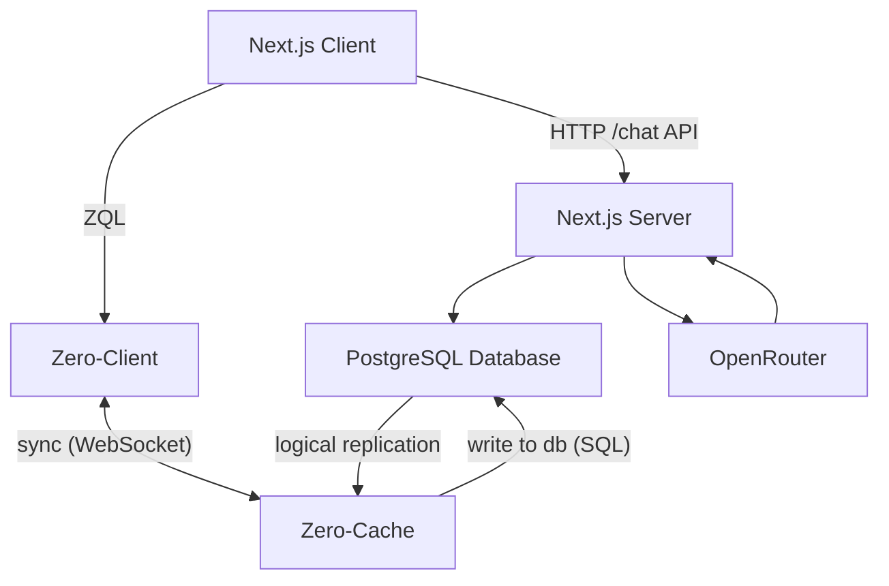

<div align="center">

# [Semaphore](https://semaphore.chat)

  <h4>The simplest, no nonsense AI chat app!</h4>
</div>

<a href="https://semaphore.chat" target="_blank" rel="noopener noreferrer">
  
</a>

## Demo

[semaphore.chat](https://semaphore.chat)

## Local Install

- Execute these commands. (assuming you have `docker` and `docker-compose` installed on your system, if not, install them first.)

```sh
git clone https://github.com/codingCoffee/semaphore

cd semaphore

docker compose up -d

# wait for a min
docker compose exec frontend npm run db:migrate
```

- Visit [http://localhost:3000](http://localhost:3000)

## Notable Features

<details>
<summary>- 💬 Chat with Various LLMs</summary>
<p>Engage with multiple large language models in one seamless interface.</p>

</details>

<details>
<summary>- 🔒 Authentication & Sync</summary>
<p>Secure your conversations and sync chats across devices with Google Login</p>

</details>

<details>
<summary>- 🌐 Browser Friendly</summary>
<p>Works smoothly in all modern web browsers—no installation required.</p>
</details>

<details>
<summary>- 🔍 Web Search (Beta)</summary>
<p>Fetch information from the web right within your chat (experimental feature).</p>

</details>

<details>
<summary>- ⏯️ Resumable Streams</summary>
<p>Resume, or replay chat streams for uninterrupted workflows.</p>

https://github.com/user-attachments/assets/8a919c00-c2ed-4c12-bf77-29505bfbe9e1

</details>

<details>
<summary>- 📊 MermaidJS Diagram Renders</summary>
<p>Visualize diagrams and flowcharts with MermaidJS integration.</p>

</details>

<details>
<summary>- 💡 Code Syntax Highlighting</summary>
<p>Enjoy beautifully highlighted code snippets for better readability.</p>

</details>

<details>
<summary>- 🌙 Dark Mode</summary>
<p>Switch between light and dark themes for comfortable browsing.</p>

</details>

<details>
<summary>- 🔑 Bring Your Own Keys</summary>
<p>Use your own API keys for enhanced privacy and customization.</p>

</details>

<details>
<summary>- 📱 Mobile Friendly</summary>
<p>Fully responsive design for a great experience on smartphones and tablets.</p>

</details>

## Architecture



## Prod Deployment

```
npm run db:migrate
```

## Contributing

semaphore is free and open source software licensed under Apache-2.0 license. If you are interested in contributing, feel free to open up a PR.

- The app is in NextJS with Typescipt support, tailwind for CSS and shadcn is used for the component library
- Postgres is used for the database
- Zero by Replicache is used for the sync engine, and to achieve resumable streams :)

## Authors

- [@codingcoffee](https://github.com/codingcoffee)

## License

semaphore is licensed under the Apache-2.0 License
